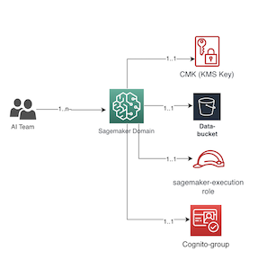
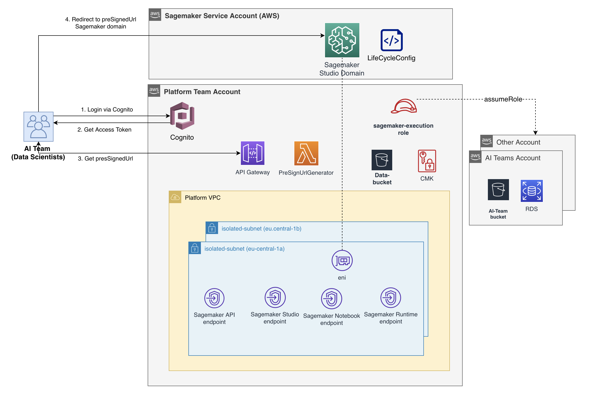
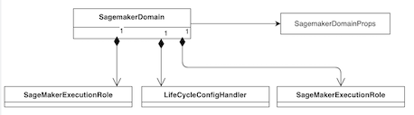

# Introduction

Amazon Sagemaker Studio offers a comprehensive set of capabilities for machine learning practitioners and provides a fully integrated development environment, enabling users to build, train, deploy, and manage machine learning models. This CDK application sets up a Sagemaker studio in VPCOnly mode and uses Cognito to manage authentication and authorization. By using VPCOnly mode and isolated subnets, any internet access to the Studio notebook is disabled by default. The end users gain access the Sagemaker Studio that is hosted in AWS Service account via a presSigned URL generated by this application. This eliminates the end users to have any direct access to the AWS console hosting these Sagemaker Domains.

## Pre-requisites

- Ensure version of CDK is 2.89.x

```cons
  npm uninstall -g aws-cdk && npm install -g aws-cdk
```

- Nodejs version is v18.x+

```terminal
  node --version
```

- For generating presSigned URL via API call, Postman v10.16.x

## Solution Architecture

The architecture enables the provisioning of one or more Sagemaker domains using CDK as infrastructure-as-code. It uses a central account and a VPC with two isolated subnets to host Sagemaker Studio domains. The VPC in the platform account has no outbound internet connectivity and employs isolated subnets for enhanced security. To ensure high availability, two identical isolated subnets are created. The Sagemaker domain is deployed in "VpcOnly" mode, which establishes an elastic network interface for communication between the Sagemaker Service account (AWS control plane) and the platform account's VPC. Endpoints like Sagemaker API, Sagemaker Studio, and Sagemaker Notebook are set up to securely and reliably facilitate communication between the platform account's VPC and the Sagemaker Domain managed by AWS in the Sagemaker Service account.



This solution allows the provisioning of one or more Sagemaker domains along with a CMK, an S3 bucket, and an IAM Role for running processing or transformation jobs. The deployment includes three main stacks, and the SagemakerStudioStack varies based on the number of Sagemaker domains, with each domain represented by a separate SagemakerStudioStack.



**InfrastructureStack** : The Infrastructure stack provisions a VPC, subnets (isolated) and vpc endpoints for Sagemaker to be deployed in VpcOnly mode.

**SagemakerLoginStack** : The SagemakerLoginStack provisions cognito user pool and a lambda function responsible for authorization. The stack creates a presSignedUrl lambda and an API gateway which generates a preSignedUrl. The API gateway has endpoint type regional for demo purpose but could be made private, in which case the API could only be accessed internally in the corporate network.

**SagemakerStudioStack** : The SagemakerLoginStack sets up a Cognito user pool and a Lambda function to handle authorization. It also creates a presigned URL Lambda and an API Gateway that generates preSigned URLs. For demonstration purposes, the API Gateway has an endpoint type of regional, but it could be configured as private, limiting access to the corporate network only.

### Constructs

The solution also includes a several high level Construct classes for creating Sagemaker domain. The SagemakerDomain class is the high level construct that is used to provision Sagemaker domain. Sagemaker uses lifecycle config to initialize the Jupyterlab and Kernelgateway apps. A custom resource class called LifeCycleConfigHandler is provided for this purpose. For handling KMS and IAM role additional construct classes are provided.



## Process Overview

Here's a concise overview of the process:

1. The user authenticates via the Cognito app and obtains the Cognito access token (we use here Postman for demo purposes).

2. Using the Cognito access token, the user calls the API Gateway, which triggers the presigned URL Lambda function.

3. The presigned URL Lambda function verifies if the user exists and belongs to the specified Cognito group (representing a Sagemaker domain). If the user is part of this group, the Lambda function creates a Sagemaker user profile if not already created, and then generates a presigned URL by making AWS SDK calls to the Sagemaker service.

4. The user receives the generated presigned URL and clicks on it, which redirects them to their respective Sagemaker domain.

## Installation

- Bootstrap your AWS Account. Please adjust the account number and region (we use eu-central-1 here), as required

  ```terminal
    cdk bootstrap aws://11111111111/eu-central-1
  ```

- Run command to compile, synthesize and deploy the application. Please adjust the account, domain-name, user and password for the application. Password should be at least 8 characters, with upper case characters and numbers. User parameter is the Sagemaker domain user that will be authenticated by Cognito. Please note that the domain-name also determines the name of S3 bucket created by the deployment. So, it is important to have a unique domain-name. If not, cdk deployment will complain about S3 bucket name created in the course of deployment


  ```terminal
    npm install
    npm run build

    //synthesize
    npx cdk synth -c account=11111111111 -c region='eu-central-1' -c domain-name=team1 -c user=demo-user -c password=<your password>

    //deploy
    npx cdk deploy --all -c account=11111111111 -c region='eu-central-1' -c domain-name=team1 -c user=demo-user -c password=<password> --require-approval never
  ```

- Download the postman app to make API call. Adjust postman configuration as described below.

  - If you don't have a Postman account, create a free account with your email. If you already have an account, signin to your account.
  - Click on the File Menu -> Import and select the [postman json file](./postman/sagemaker-postman.json) included in this repo. Import this file.
  - Click on the File Menu -> Import and select the [postman environment json file](./postman/sagemaker.postman_environment.json) included in this repo. Import this file.
  - Go to **'Environments'** tab in the Postman. You will see an envionment called 'Sagemaker' from previous step. Add the below env variables which you would see as part of the stack deployment output in console.

    ```console
      .....  output from the cdk deploy .....

      //PreSignedURLApi
      sagemaker-login-stack.PreSignedURLApiEndpointXXXX= https://xxxxxxx.execute-api.eu-central-1.amazonaws.com/prod/

      //UserPoolClientId
      sagemaker-login-stack.UserPoolUserPoolClientIdFXXXX = xxxxxxxxxxxxxxxx

      //UserPoolClientSecret
      sagemaker-login-stack.UserPoolUserPoolClientSecretC1D088A5 = xxxxxxxxxxxxxxx

      //CognitoSigninDomain
      sagemaker-login-stack.UserPoolCognitoSigninDomainD3B08161 = https://sagemaker-login-xxxxx.auth.eu-central-1.amazoncognito.com/oauth2
    ```

    - _domainName_: Set this to the domain-name paramter you passed in cdk deploy domain-name parameter for example 'team1'
    - _client-id_: This is the Cognito client ID. Fetch this from the output during cdk deploy.
    - _client-secret_: To get Cognito client secret. Fetch this from output of cdk output.
    - _sagemaker-presigned-api_: This is the URL of the API gateway created by the cdk which generates the pre-signed-url. Fetch this from output of cdk output as well.
    - _cognito-signin-endpoint_: This is the endpoint URL of the Cognito Domain where the client app (in this case Postman) authenticates by providing credentials of the user ('demo-user'). Fetch this from output of cdk output. The CDK app generates a globally unique cognito domain using the convention **sagemaker-login-<your account id>**

  - In Postman click on Collections -> Sagemaker and select the `Authorization` tab. All the values in this tab should be prefilled already. On the top right corner select the environment 'Sagemaker' that was populated earlier (it is quite possible, No Environment is selected by default).  Scroll down in the page and click on 'Get New Access Token'.
  - This opens up a pop-up window where you can login into Cognito with the user name and password which you used in cdk deploy step and passed as parameters.
  - Upon successful authentication a new access token is generated. Select `Use Token`
  - Now click on `GeneratePresignedUrlDemo` in the Postman Sagemaker collections and click on `Send`. Make sure you selected the right envionment (Sagemaker) on the top right corner from the dropdown list.

- This makes a REST API call to API gateway and generates a preSigned URL to access #Sagemaker domain. You can see this URL in the response Body.
- Copy this URL and paste it in the Browser window. A new Sagemaker domain would be launched with your user profile.

## Cleanup

- From the AWS Console > Sagemaker > Domain > User Profile > Apps Make sure all running apps (Kernel gateway or Jupyter lab) are stopped and deleted
- Ensure all Sagemaker user profiles which are created during login step, are deleted as well
- From AWS console > EFS > select the EFS created for demo > Delete. It will open a dialog box. Confirm delete. To learn more visit [how to delete Elastic File System](https://docs.aws.amazon.com/efs/latest/ug/delete-efs-fs.html)
- Run the below command
  ```
  npx cdk destroy --all
  ```
  
## License
This library is licensed under the MIT-0 License. See the LICENSE file.

## Security
See [CONTRIBUTING](CONTRIBUTING.md#security-issue-notifications) for more information.
