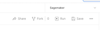

# Introduction

Amazon SageMaker Studio offers a comprehensive set of capabilities for machine learning practitioners and provides a fully integrated development environment, enabling users to build, train, deploy, and manage machine learning models. This CDK application sets up a SageMaker studio in VPCOnly mode and uses Cognito to manage authentication and authorization. By using VPCOnly mode and isolated subnets, any internet access to the Studio notebook is disabled by default. The end users gain access the SageMaker Studio that is hosted in AWS Service account via a presSigned URL generated by this application. This eliminates the end users to have any direct access to the AWS console hosting these SageMaker Domains.

## Pre-requisites

- Ensure version of CDK is at least 2.102.x

```console
  npm uninstall -g aws-cdk && npm install -g aws-cdk
```

- Nodejs version is v18.x+

```terminal
  node --version
```

- For generating presSigned URL via API call, Postman v10.16.x

## Solution Architecture

The architecture enables the provisioning of one or more SageMaker domains using CDK as infrastructure-as-code. It uses a central account and a VPC with two isolated subnets to host SageMaker Studio domains. The VPC in the platform account has no outbound internet connectivity and employs isolated subnets for enhanced security. To ensure high availability, two identical isolated subnets are created. The SageMaker domain is deployed in "VpcOnly" mode, which establishes an elastic network interface for communication between the SageMaker Service account (AWS control plane) and the platform account's VPC. Endpoints like SageMaker API, SageMaker Studio, and SageMaker Notebook are set up to securely and reliably facilitate communication between the platform account's VPC and the SageMaker Domain managed by AWS in the SageMaker Service account.


This solution allows the provisioning of one or more SageMaker domains along with a CMK, an S3 bucket, and an IAM Role for running processing or transformation jobs. The deployment includes three main stacks, and the SageMakerStudioStack varies based on the number of SageMaker domains, with each domain represented by a separate SageMakerStudioStack.


**InfrastructureStack** : The Infrastructure stack provisions a VPC, subnets (isolated) and vpc endpoints for SageMaker to be deployed in VpcOnly mode.

**SageMakerLoginStack** : The SageMakerLoginStack provisions cognito user pool and a lambda function responsible for authorization. The stack creates a presSignedUrl lambda and an API gateway which generates a preSignedUrl. The API gateway has endpoint type regional for demo purpose but could be made private, in which case the API could only be accessed internally in the corporate network.

**SageMakerStudioStack** : The SageMakerLoginStack sets up a Cognito user pool and a Lambda function to handle authorization. It also creates a presigned URL Lambda and an API Gateway that generates preSigned URLs. For demonstration purposes, the API Gateway has an endpoint type of regional, but it could be configured as private, limiting access to the corporate network only.

### Constructs

The solution also includes a several high level Construct classes for creating SageMaker domain. The SageMakerDomain class is the high level construct that is used to provision SageMaker domain. SageMaker uses lifecycle config to initialize the Jupyterlab and Kernelgateway apps. A custom resource class called LifeCycleConfigHandler is provided for this purpose. For handling KMS and IAM role additional construct classes are provided.


## Process Overview

Here's a concise overview of the process:

1. The user authenticates via the Cognito app and obtains the Cognito access token (we use here Postman for demo purposes).

2. Using the Cognito access token, the user calls the API Gateway, which triggers the presigned URL Lambda function.

3. The Lambda function generates a presigned URL by making AWS SDK calls to the SageMaker Studio service.

4. The user receives a generated presigned URL. On clicking this URL, the user is redirected to the SageMaker domain.

## Installation of CDK demo

The demo CDK application provides a concise overview of key components such as the SageMaker domain, Lifecycle Configuration, authentication through Cognito, and IAM role with the least privileges. Within the application, the SagemakerStudioStack class handles the provisioning of a SageMaker domain, an IAM Role (sagemaker-execution-role) that users assume, a customer-managed key (CMK), Lifecycle Configuration, SageMaker user profile, an S3 bucket for data processing, and a Cognito user group.The SagemakerLoginStack, on the other hand, is responsible for deploying the Cognito UserPool, Lambda function, and API gateway for generating pre-signed URLs. The CognitoUserStack primarily focuses on deploying a user within the Cognito user pool.

- Bootstrap your AWS Account. Please adjust the account number and region (we use eu-central-1 here), as required

  ```terminal
    cdk bootstrap aws://11111111111/eu-central-1
  ```

- Run the command to compile, synthesize and deploy the application. Please adjust the account, user and password for the application. Password should be at least 8 characters, with upper case characters and numbers. User parameter is the SageMaker domain user that will be authenticated by Cognito.

  - Installs packages & compile the code

    ```terminal
      npm install
      npm run build
    ```

  - Synthesize the CDK application

    ```terminal
      npx cdk synth -c account=11111111111 -c region='eu-central-1' -c domain-name=team1 -c user=demo-user -c password=<your password>
    ```

  - Deploy the application with all stacks into the account and region of your choice

    ```terminal
      npx cdk deploy --all -c account=11111111111 -c region='eu-central-1' -c domain-name=team1 -c user=demo-user -c password=<password> --require-approval never
    ```

- Download the postman app to make API call. Adjust postman configuration as described below.

  - If you don't have a Postman account, create a free account with your email. If you already have an account, signin to your account.
  - Click on the File Menu -> Import and select the [postman json file](./postman/sagemaker-postman.json) included in this repo. Import this file.
  - Click on the File Menu -> Import and select the [postman environment json file](./postman/sagemaker.postman_environment.json) included in this repo. Import this file.
  - Go to **'Environments'** tab in the Postman left panel. You will see an envionment called 'Sagemaker' from previous step. Add the below env variables which you would see as part of the stack deployment console output from **SagemakerLoginStack**.

    

    ````console
    ..... output from the cdk deploy .....

          //PreSignedURLApi
          SageMaker-login-stack.PreSignedURLApiEndpointXXXX= https://xxxxxxx.execute-api.eu-central-1.amazonaws.com/prod/

          //UserPoolClientId
          SageMaker-login-stack.UserPoolUserPoolClientIdFXXXX = xxxxxxxxxxxxxxxx

          //UserPoolClientSecret
          SageMaker-login-stack.UserPoolUserPoolClientSecretC1D088A5 = xxxxxxxxxxxxxxx

          //CognitoSigninDomain
          SageMaker-login-stack.UserPoolCognitoSigninDomainD3B08161 = https://sagemaker-login-xxxxx.auth.eu-central-1.amazoncognito.com/oauth2
        ```

        - _domainName_: Set this to the domain-name paramter you passed in cdk deploy domain-name parameter for example 'team1'
        - _client-id_: This is the Cognito client ID. Fetch this from cdk output.
        - _client-secret_: To get Cognito client secret. Fetch this from output of cdk output.
        - _sagemaker-presigned-api_: This is the URL of the API gateway created by the cdk which generates the pre-signed-url. Fetch this from cdk output.
        - _cognito-signin-endpoint_: This is the OAuth endpoint URL of the Cognito Domain where the client app (in this case Postman) authenticates by providing credentials of the user ('demo-user'). Fetch this from cdk output. The CDK app generates a globally unique cognito domain using the convention **sagemaker-login-[ACCOUNT_ID].auth.eu-central-1.amazoncognito.com/oauth2**

    ````

  - Make sure to save the environment in the postman.

    

  - In Postman click on Collections -> Sagemaker and select the `Authorization` tab. All the values in this tab should be prefilled already. On the top right corner select the environment 'Sagemaker' that was populated earlier (it is quite possible, No Environment is selected by default). Scroll down in the page and click on 'Get New Access Token'.

    

  - This opens up a pop-up window where you can login into Cognito with the user name and password which you used in cdk deploy step and passed as parameters.
  - Upon successful authentication a new access token is generated. Select `Use Token`
  - Now click on `GeneratePresignedUrlDemo` in the Postman SageMaker collections and click on `Send`. Make sure you selected the right envionment (SageMaker) on the top right corner from the dropdown list.

- This makes a REST API call to API gateway and generates a preSigned URL to access SageMaker domain. You can see this URL in the response body.
- Copy this URL and paste it in the Browser window. A new SageMaker domain would be launched with your user profile.

## Cleanup

- From the AWS Console > SageMaker > Domain > User Profile > Apps Make sure all running apps (Kernel gateway or Jupyter lab) are stopped and deleted
- From AWS console > EFS > select the EFS created for demo > Delete. It will open a dialog box. Confirm delete. To learn more visit [how to delete Elastic File System](https://docs.aws.amazon.com/efs/latest/ug/delete-efs-fs.html)
- Once the EFS is deleted, you need to need security groups associated with the EFS as well.
  - From AWS console go to EC2 -> Security Groups -> select security group for inbound EFS -> edit inboud rules -> Delete the existing rule
  - From AWS console go to EC2 -> Security Groups -> select security group for outbound EFS -> edit outbound rules -> Delete the existing rule
  - From AWS console go to EC2 -> Security Groups -> select security groups for inbound and outbound EFS -> Actions -> Delete. This will pop-up a dialog box. Confirm that you want to delete the Security Groups.
- Run the below command. Use the same values that you used earlier while creating the CDK stack.
  ```
  npx cdk destroy --all -c account=11111111111 -c region='eu-central-1' -c domain-name=team1 -c user=demo-user -c password=<password> --require-approval never
  ```

## License

This library is licensed under the MIT-0 License. See the LICENSE file.

## Security

See [CONTRIBUTING](CONTRIBUTING.md#security-issue-notifications) for more information.
